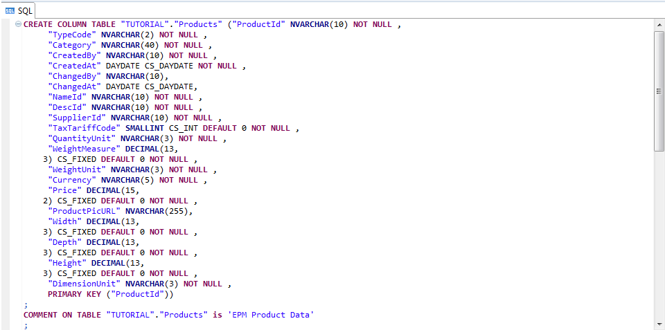
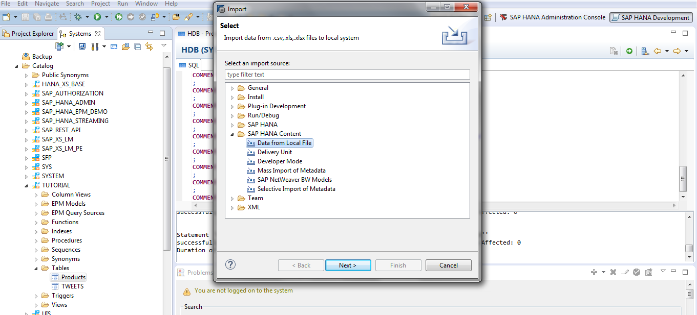
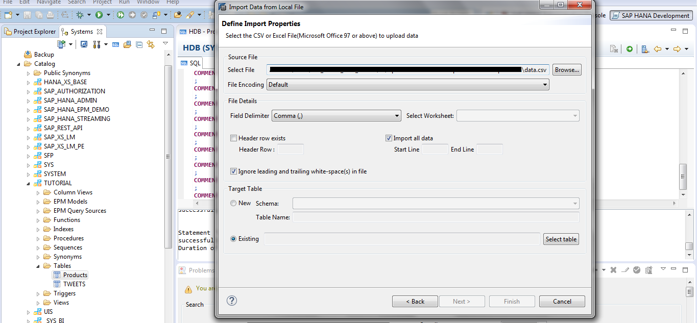
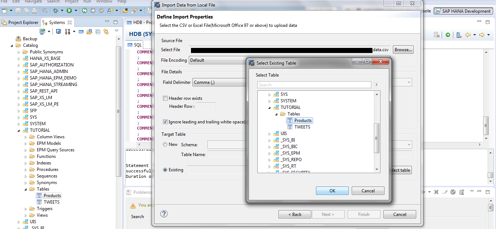
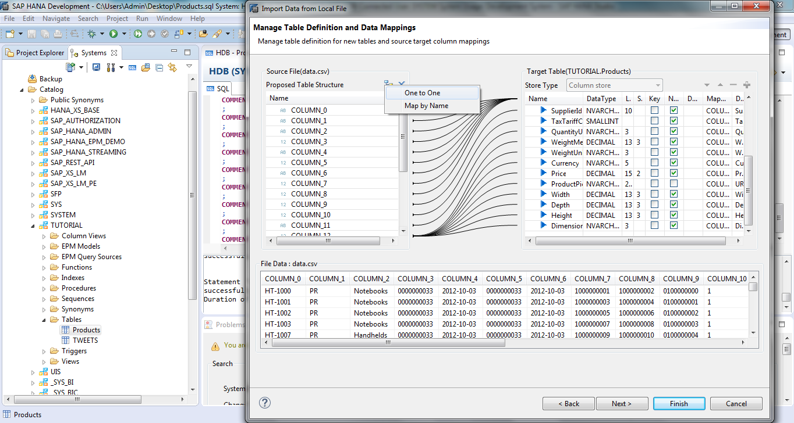
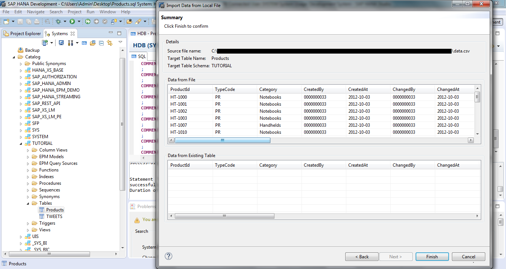
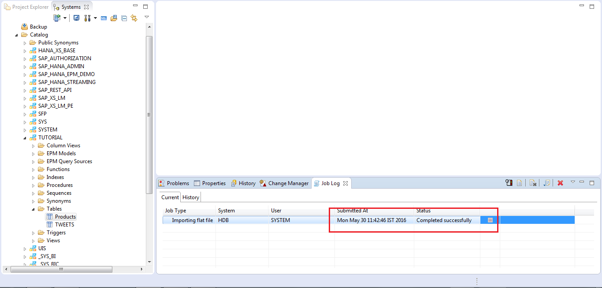

<h1>Create HANA Table by importing data from Flat File </h1>
---------------------------------------------------------------------------

<h2> SAP HANA Studio </h2>

- HANA Studio is an Eclipse-based, integrated development environment (IDE) that is used to develop artifacts in a HANA server
- HANA Studio enables technical users to manage the SAP HANA database, to create and manage user authorizations, to create new or modify existing models of data etc.
- It is a client tool, which can be used to access local or remote HANA system
- The SAP HANA studio provides an environment for Administration, Modeling and Data Provisioning. There are several predefined User Interface layouts addressing several applications types called Perspectives. 
In HANA Studio every HANA system has two main sub-nodes, Catalog and Content
- To run Hana Studio Java JRE 1.6 or 1.7 must be installed in our system. The Java runtime must be specified in the PATH variable.

1.Create hana table **Products.sql**

- Copy the SQL statement from the **Products.sql** and execute it in SQL console
- Now we have created the **Products.sql** table in HANA system without any data inside the table

2.Populate the table using import from Data.csv 

- Switch to ‘Systems’. Go to Catalog -> TUTORIAL(Schema) -> Tables -> **Products**
- Right click on **Products** -> Import -> SAP HANA Content -> Data from Local File, Click next

   

- Browse the **data.csv** file and select "Existing" in **Target table** panel of the dialog box and select the existing table and click **"OK"**

- Map the data by selecting **one by one** option and Click **"Finish"**

- Importing the **flat file** is succesfull

In the next tutorial we'll create xsproject for AngularJS app

