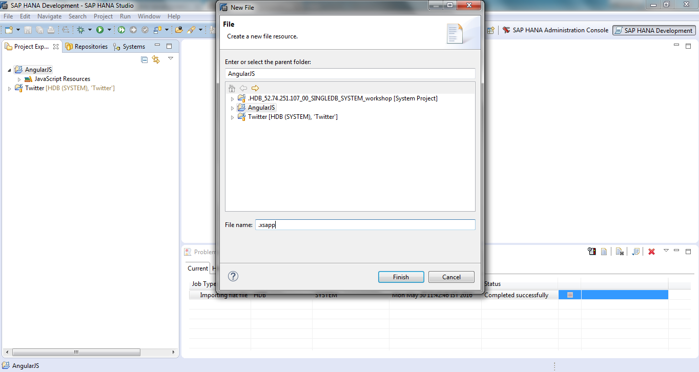
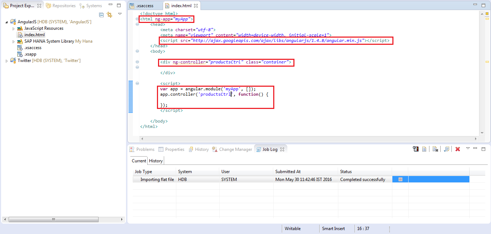

<h1>Create XS project for AngularJS app</h1>
---------------------------------------------------------------------------

1.Create **XS project**

- Switch to ‘project explorer’. Go to File -> New -> Project -> "**XS Project** -> Give the project name (In our example it's AngularJS)

2.Create .xsapp 

- Right click on your XS project(AngularJS) and create a new file call ".xsapp".

3.Create .xsaccess– copy the file content

- Right click on your XS project(AngularJS) and create a new file call “.xsaccess”

- Share the project with the HANA system

4.service.xsodata - copy the file content 

- Right click on your XS project(AngularJS) and create a new file call “service.xsodata” and click **finish**

- Here we're creating odata service on the Product table from TUTORIAL schema(Which we created in first tutorial)

- Activate all the files present in your xs project(AngularJS)

- Test the odata service on browser

5.create index.html for AngulerJs app 

- Right click on your XS project(AngularJS) and create a new file call “index.html” and click **finish**

<h3>Main parts of AngularJS app</h3>

- To define AngularJs application in our Angular App we are going to define ng-app="myApp" in html tag
- AngularJS is distributed as a JavaScript file and we can define AngularJS to a web page with a script tag:      "http://ajax.googleapis.com/ajax/libs/angularjs/1.4.8/angular.min.js" on head
- Now we need to define Application Controller to our code by the tag: ng-controller="productsCtrl" to div tag(where we want to get data from the JS script).Controller is created by Javascript ObjectConstructor,it is a JavaScript Object.
- In script create a Angular Js app "var app = angular.module('myApp', [ ]);",this application will run under 
 of our script
- Now we need to write  the actual code in "app.controller"
- Here 'productsCtrl' function is a javascript function.

In the next tutorial we'll consume the oData Service in Angular app to show the datas in our Angular app

