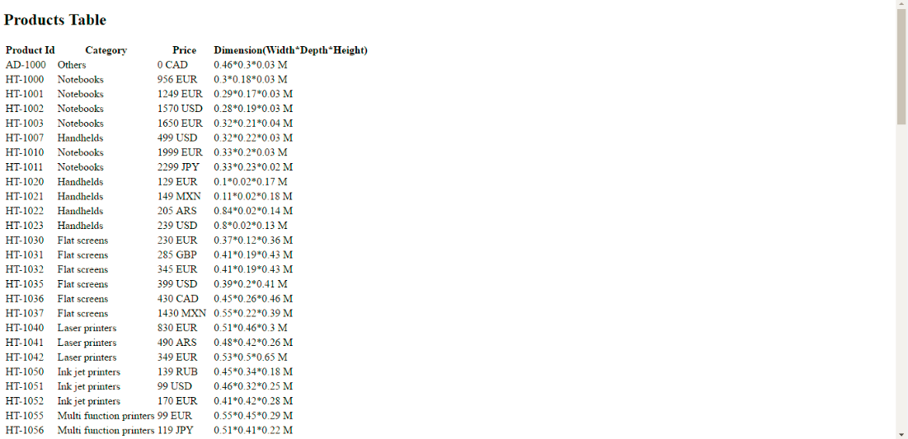

<h1> Angular- with Odata service </h1>
---------------------------------------------------------------------------
We will use **$http** to consume the odata service in AngularJS app

- **$http** is an AngularJS service for reading data from remote servers
- **AngularJS $http** service makes a request to the server, and returns a response
- The $http service is a core Angular service that facilitates communication with the remote HTTP servers via the browser's XMLHttpRequest object

1.Call the odata service using $http

- A view of AngularJS code

2.Output

3.Use **Bootstrap**

- Bootstrap is the most popular HTML, CSS, and JavaScript framework for developing responsive, mobile-first web sites
- Bootstrap makes front-end web development faster and easier
- It's made for folks of all skill levels, devices of all shapes, and projects of all sizes
- Bootstrap easily and efficiently scales your websites and applications with a single code base, from phones to tablets to desktops with CSS media queries
- With Bootstrap, you get extensive and beautiful documentation for common HTML elements, dozens of custom HTML and CSS components, and awesome jQuery plugins
- Bootstrap is open source. It's hosted, developed, and maintained on GitHub
- Millions of amazing sites across the web are being built with Bootstrap

4.Output

